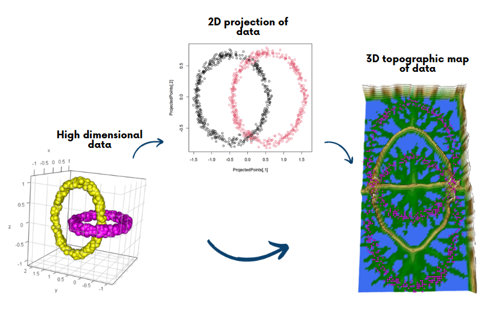

[](https://cran.r-project.org/package=GeneralizedUmatrix)
[](https://r-pkg.org/pkg/GeneralizedUmatrix)
[](https://r-pkg.org/pkg/GeneralizedUmatrix)

# GeneralizedUmatrix

### Table of Contents  
[1. Introduction](#introduction)  
[2. Installation](#installation)  
[3. Additional Ressources](#additional)  
[4. References](#references)  

## 1. Introduction <a name="introduction"/>

Dimensionality Reduction methods are either manifold learning approaches or methods of projection. Projection methods should be prefered if the goal is the visualization of cluster structures [Thrun, 2018]. Two-dimensional projections are visualized as scatter plot. The Johnson–Lindenstrauss lemma states that in such a case the low-dimensional similarities does not represent high-dimensional distances coercively (details in [Thrun/Ultsch,2018]. To solve this problem the high-dimensional distances can be visualized in the two-dimensional projection as 3D landscape of a topographic map with hypsometric tints [Thrun, 2018; Ultsch/Thrun, 2017; Thrun et al., 2016].

The GeneralizedUmatrix package allows to
- **Calculate Generalized Umatrix with ESOM:** Calcuation of the Umatrix with emergent self organizing map (ESOM).
- **Visualize Umatrix as 3D landscape:** Visualization of the Umatrix as topographic map with hypsometric tints.

The 3D topographic map of a 2D projection visualizes projection errors, where neighboring projected points in a 2D scatter plot are not similar to each other in the high-dimensional space.
The U-matrix visualizes these errors in a topographic map as landscape, where similar points are represented in a valley, dissimilar points are separated by mountains and thus non-structured/chaotic neighborhoods are represented as hilly area.
The visualization can be used both for the interactive identification of cluster structures by a human user or automatized by taking decisions boundaries based on mountain ridges.


Use a projection method of choice to project the high dimensional data into 2 dimensions. Here cmdscale, a classical MDS algorithm is used.



```{}
data(Chainlink)
Data=Chainlink$Data
Cls=Chainlink$Cls

InputDistances = as.matrix(dist(Data))
model = cmdscale(
  d = InputDistances, k = 2, eig = TRUE, add = FALSE, x.ret = FALSE
)
ProjectedPoints = as.matrix(model$points)
```

Calculate generalized Umatrix
```{}
genUmatrix = GeneralizedUmatrix(Data, ProjectedPoints)
```

Plot topographic map of the Umatrix
```{}
plotTopographicMap(genUmatrix$Umatrix, 
                   genUmatrix$Bestmatches, 
                   NoLevels = 10)
```

## Installation <a name="installation"/>

#### Installation using CRAN
Install automatically with all dependencies via

```R
install.packages("GeneralizedUmatrix",dependencies = T)
```

#### Installation using Github
Please note, that dependecies have to be installed manually.

```R
remotes::install_github("Mthrun/GeneralizedUmatrix")
```

#### Installation using R Studio
Please note, that dependecies have to be installed manually.

*Tools -> Install Packages -> Repository (CRAN) -> GeneralizedUmatrix*

## Additional Ressources <a name="additional"/>

### Tutorial Examples
The tutorial with several examples can be found on in the vignette on CRAN:

https://cran.r-project.org/web/packages/GeneralizedUmatrix/vignettes/GeneralizedUmatrix.html

### Manual

The full manual for users or developers is available here:
https://cran.r-project.org/web/packages/GeneralizedUmatrix/GeneralizedUmatrix.pdf

## References <a name="references"/>

[Thrun/Ultsch, 2020] Thrun, M. C., & Ultsch, A.: Uncovering High-Dimensional Structures of Projections from Dimensionality Reduction Methods, MethodsX, Vol. 7, pp. 101093, DOI https://doi.org/10.1016/j.mex.2020.101093, 2020.

[Thrun, 2018] Thrun, M. C.: Projection Based Clustering through Self-Organization and Swarm Intelligence, doctoral dissertation 2017, Springer, Heidelberg, ISBN: 978-3-658-20539-3, https://doi.org/10.1007/978-3-658-20540-9, 2018.

[Ultsch/Thrun, 2017] Ultsch, A., & Thrun, M. C.: Credible Visualizations for Planar Projections, in Cottrell, M. (Ed.), 12th International Workshop on Self-Organizing Maps and Learning Vector Quantization, Clustering and Data Visualization (WSOM), IEEE Xplore, France, 2017.

[Thrun et al., 2016] Thrun, M. C., Lerch, F., Loetsch, J., & Ultsch, A.: Visualization and 3D Printing of Multivariate Data of Biomarkers, in Skala, V. (Ed.), International Conference in Central Europe on Computer Graphics, Visualization and Computer Vision (WSCG), Vol. 24, Plzen, http://wscg.zcu.cz/wscg2016/short/A43-full.pdf, 2016.

## Citation <a name="citation"/>
Please use the following citation:

Thrun, M. C., & Ultsch, A: Uncovering High-Dimensional Structures of Projections from Dimensionality Reduction Methods, MethodsX Vol. 7 pp. 101093, DOI: 10.1016/j.mex.2020.101093, 2020.

